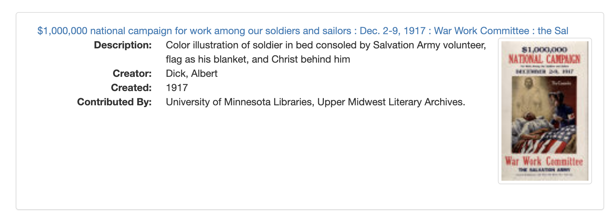
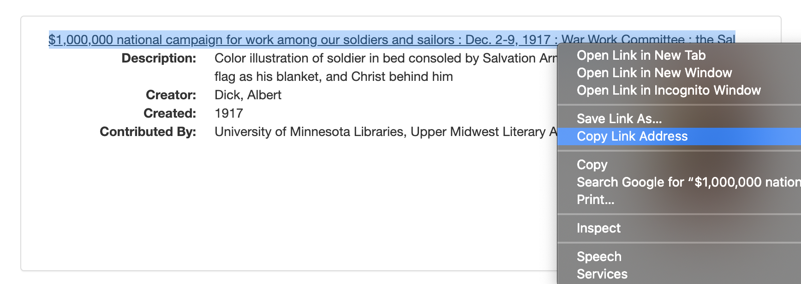

# How to construct IIIF calls to UMedia

_by << liu00222 >>_

As an example of downloading digital objects from UMedia, we will first explore how to download still images. 

This document will introduce an image delivery API defined by the International Image Interoperability Framework (IIIF) Consortium. By using the [IIIF Image API](https://iiif.io/api/image/2.1/), users can get an image in response to a standard HTTP or HTTPS request. By editing the URL, users can specify the region, size, rotation, quality, and format of the requested image. 

The general form of the URL for an image in UMedia is: 

```
https://cdm16022.contentdm.oclc.org/digital/iiif/[collection-name]/[record-id]/[region]/[size]/[rotation]/[quality].[format]
```

We will talk about the details one at a time. 

### 1. Base URL

The Base URL for all UMedia images via API is: 

```
https://cdm16022.contentdm.oclc.org/digital/iiif/
```

When you form your own URL, make sure to include that in front of your URL.

### 2. Identifiers

As indicated in the general form above, there are two identifiers in the URL: collection name and record ID. Figuring out the identifiers of your target object is the most critical part to form the URLt. I will use an example to illustrate how to find the identifiers of a target object. 

Suppose this is the object we want to download: 



Let's first copy its link address: 



The link address that we just copied is: 

```
https://umedia.lib.umn.edu/item/p16022coll208:4833?facets%5Btypes%5D%5B%5D=Still+Image
```

The information about the identifiers we need is included in this link address! Notice that after "item/", there is a unique identifer, "p16022coll208:4833". This is the code we want. To break it down, it says that the collection name is p16022coll208 and the record ID is 4833. 

For the image above, then, the first part of our IIIF API call would be:

```
https://cdm16022.contentdm.oclc.org/digital/iiif/p16022coll208/4833/
```

You'll note that this displays technical metadata about the image, but not the image itself. To download the image using the API, we have to note some technical specifications in the URL as well. 

### 3. Specifications

If you want to download the original image without any modification, use the following specifications:

```
full    for [region]
full    for [size]
0       for [rotation]
default for [quality]
jpg     for [format]
```

For example, the full URL for the image above (p16022coll208:4833), using the default specifications would be: 

```
https://cdm16022.contentdm.oclc.org/digital/iiif/p16022coll208/4833/full/full/0/default.jpg
```

You can open this URL in your browser to view and download the image. 

Of course, there are a lot of options for users to choose for region, size, rotation, quality, and format. 

To view more specification options for a specific record you can go to:

```
https://cdm16022.contentdm.oclc.org/digital/iiif/[collection-name]/[record-id]
```

So, for the example above, view:
```
https://cdm16022.contentdm.oclc.org/digital/iiif/p16022coll208/4833/
```

To find more information about the IIIF syntax check out the full API: 

```
http://iiif.io/api/image/2.1/
```