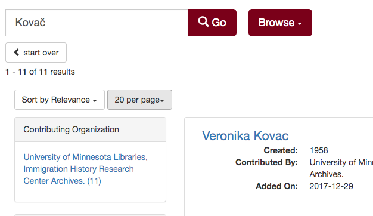
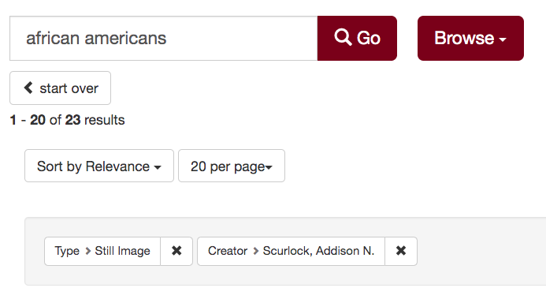

# Using the UMedia API

_by << liu00222 >>_

## How to access the JSON API to bulk access data from UMedia

[UMedia](https://umedia.lib.umn.edu/) provides open access to digitized materials from across the University of Minnesota. The search interface for UMedia includes an API that you can access by modifying the URLs to point to JSON representations of both UMedia search results as well as individual records for UMedia objects.


### Create JSON URLs quickly using the UMedia interface

To create an API URL for UMedia, you can simply append ".json" before the question mark in any UMedia URL. 

This search, for example, displays the UMedia Historical Maps collection:

```
https://umedia.lib.umn.edu/search?facets%5Bcollection_name_s%5D%5B%5D=Historical+Maps
```

To view the API results for the search above, you can add ".json" after "search" and before "?":

```
https://umedia.lib.umn.edu/search.json?facets%5Bcollection_name_s%5D%5B%5D=Historical+Maps
```

Note that you can also manually request more results, by adding "&rows=" at the end of your URL, along with the number of the search results you would like to see. If you want to use the API to download the metadata for the entire Historical Maps collections, you could add "&rows=8763" to the end of the URL (caution: this might take a long time to load):

```
https://umedia.lib.umn.edu/search.json?facets%5Bcollection_name_s%5D%5B%5D=Historical+Maps&rows=8763 
```

#### Individual records
Adding ".json" also works for URLs of individual records in UMedia. 

Here's a 15th century map of Afghanistan and Pakistan:

```
https://umedia.lib.umn.edu/item/p16022coll251:3420?
```

And here's the API call to view the same record in JSON:

```
https://umedia.lib.umn.edu/item/p16022coll251:3420.json?
```

### Limitations

- The UMedia API will not download digital objects (e.g., images) from UMedia. Please see the IIIF Documentation for instructions of how to access digial objects programmatically.
- Some metadata fields are not accessible via the JSON for search results. They can be accessed by viewing the full JSON for an individual record.

### Formatting URLs: 

The general form of the URL to use to make a JSON API call of UMedia: 

```
https://umedia.lib.umn.edu/search.json?facets%5Bfilter_1%5D%5B%5D=key_1&facets%5Bfilter_2%5D%5B%5D=key_2&sort=&q=k
```

The structure of the URL of UMedia's JSON page is formed by three parts: 

1. Base URL
2. Filters
3. Search by Keyword

Let us go through them one by one. 

### 1. Base URL

The base URL is the same for every UMedia page. You can simply copy this: 

```
https://umedia.lib.umn.edu/search.json?
```

### 2. Filters: 

Use filters to narrow the scope of your search. The format is here: 

```
facets%5Bfilter_1%5D%5B%5D=key_1&facets%5Bfilter_2%5D%5B%5D=key_2
```

You can just replace "filter_1" with the filter you want. It is the same for "filter\_2", "key\_1", and "key\_2". 

For example, if you want the creator of all the search results be Detroit Publishing Co., the URL would be: 

```
facets%5Bcreator_ss%5D%5B%5D=Detroit Publishing Co.
```

If you want to add more filters, just append them at the end or your URL string. 
Remember to use "&" to connect them. 

For example, here we set the "types" filter to "Still Image": 

```
facets%5Bcreator_ss%5D%5B%5D=Detroit+Publishing+Co.&facets%5Btypes%5D%5B%5D=Still Image
```

Don't forget to put the base URL in the front! After this, the final URL would be: 

```
https://umedia.lib.umn.edu/search.json?facets%5Bcreator_ss%5D%5B%5D=Detroit+Publishing+Co.&facets%5Btypes%5D%5B%5D=Still Image
```

Another helpful filter is the Collection Name filter. To display all of the Digitizing Immigrant Letters collection, for example:

```
https://umedia.lib.umn.edu/search.json?facets%5Bcollection_name_s%5D%5B%5D=Digitizing+Immigrant+Letters
```

### 3. Keyword Search: 

For this part, the format is: 

```
&q=k
```

To form your own URL, just replace the "k" above by the keyword(s) that you want to search with. 

For example, if you want to search "Kovač" as shown below: 



Then the URL of this part would just be: 

```
&q=Kovač
```

Note: The URL reader will automatically translate non-English characters as well as special characters such as spaces into the ASCII code, so there is no need for you to worry about character encoding. 

So to search "Kovač", your final URL would be: 

```
https://umedia.lib.umn.edu/search.json?&q=Kovač
```

What if I want to search a keyword with filters? For instance, I want to search "African Americans" and then limit my results to "Still Image" and the creator "Scurlock, Addison N.": 



You can simply use "&" to connect your filters with the search keywords.


The filter for "Creator" is: 

```
facets%5Bcreator_creator_ss%5D%5B%5D=Scurlock, Addison N.
```

The filter for "Still Image" is:

```
facets%5Btypes%5D%5B%5D=Still+Image
```


The URL for searching for the keywords "African Americans" is: 

```
q=African Americans
```

The result of putting those all together: 

```
https://umedia.lib.umn.edu/search?facets%5Bcreator_ss%5D%5B%5D=Scurlock%2C+Addison+N.&facets%5Btypes%5D%5B%5D=Still+Image&q=african+americans
```

If you want to get more detailed information, you can enter into the JSON page of the object and then iterate through it to get the full information. 


## _Appendix:_ 

### Filter table: 
| In English               |   In the URL                          |
| ------------------------ | -------------------------------------:|
| Collection               |   collection\_name\_s                 |
| Type                     |   types                               |
| Format                   |   format\_name                        |
| Date                     |   date\_created\_ss                   |
| Subject                  |   subject\_ss                         |
| Contribution Orgnization |   contribution\_organization\_name\_s |